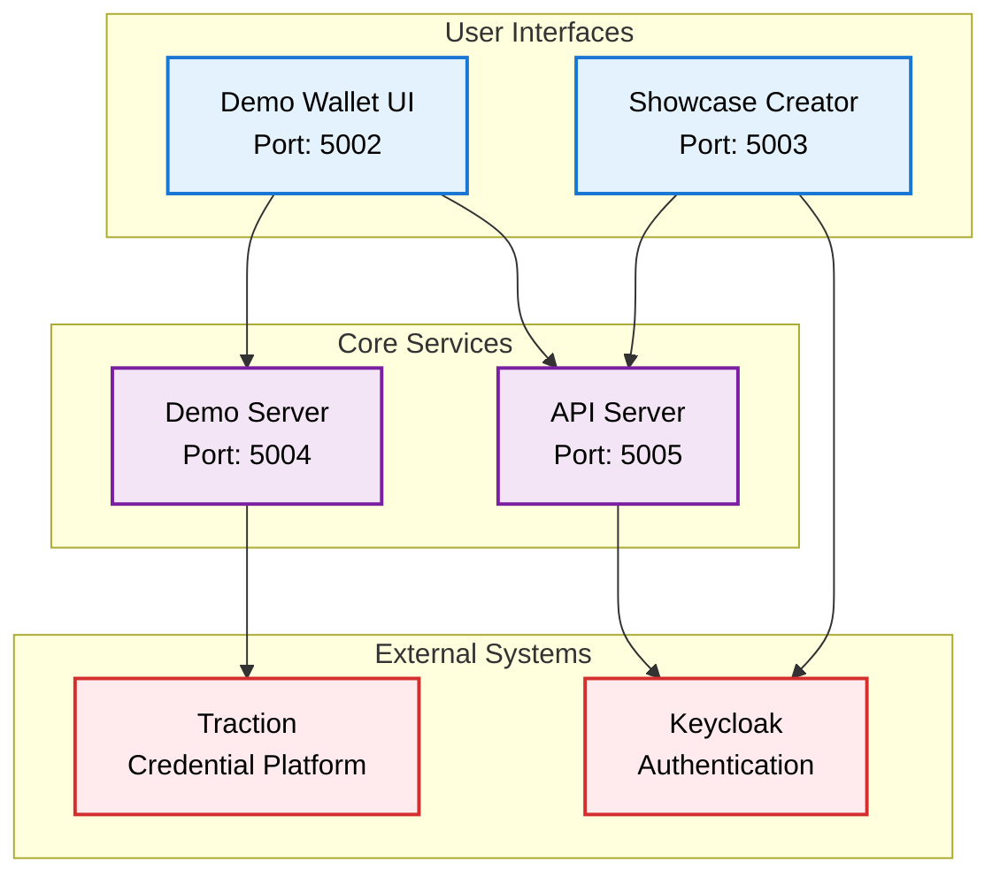
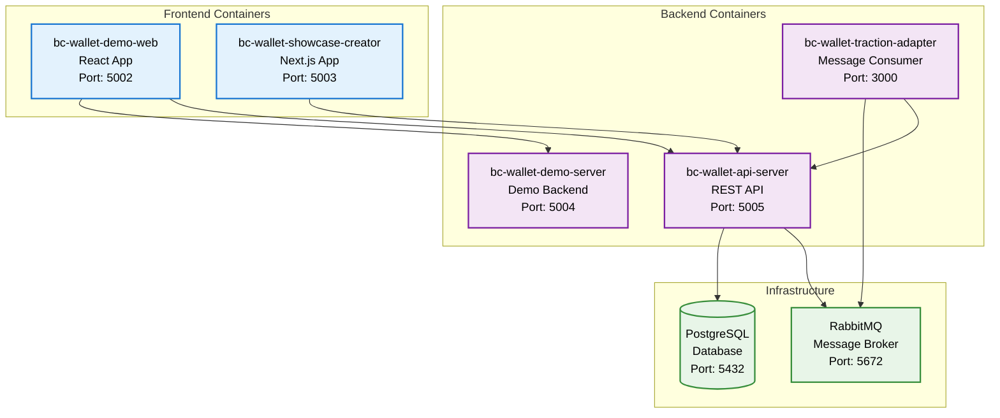
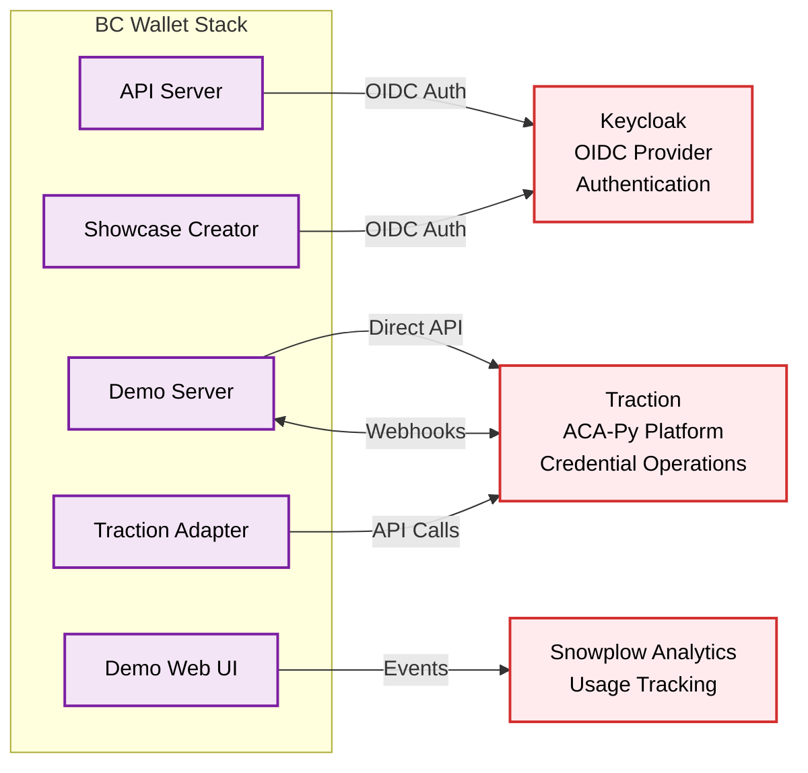
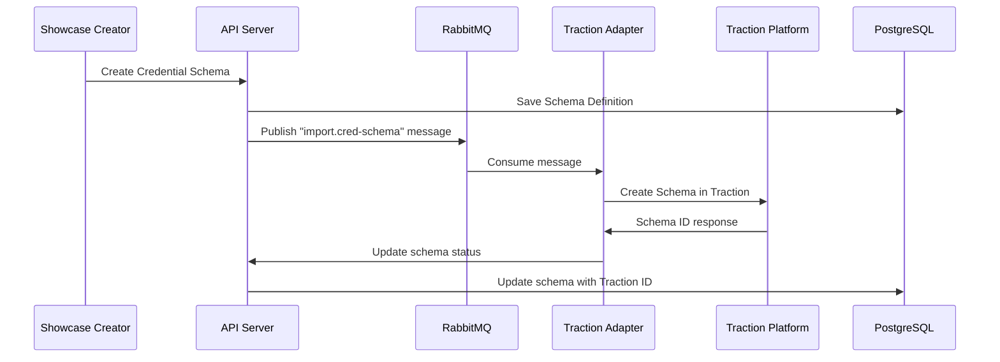
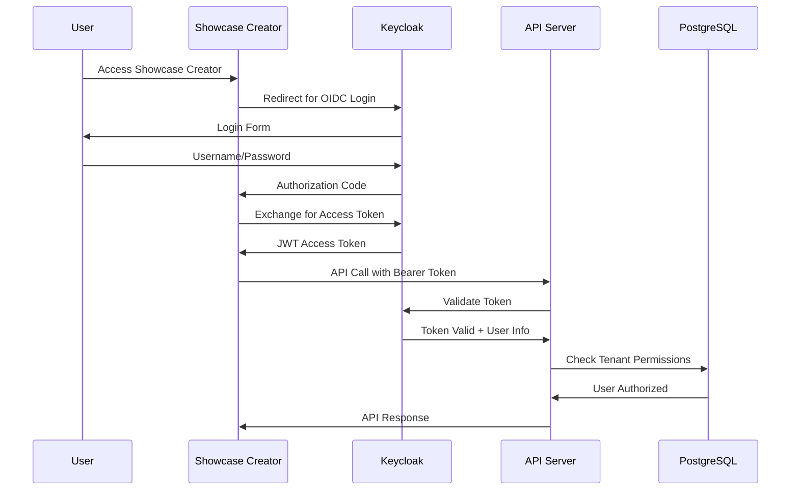
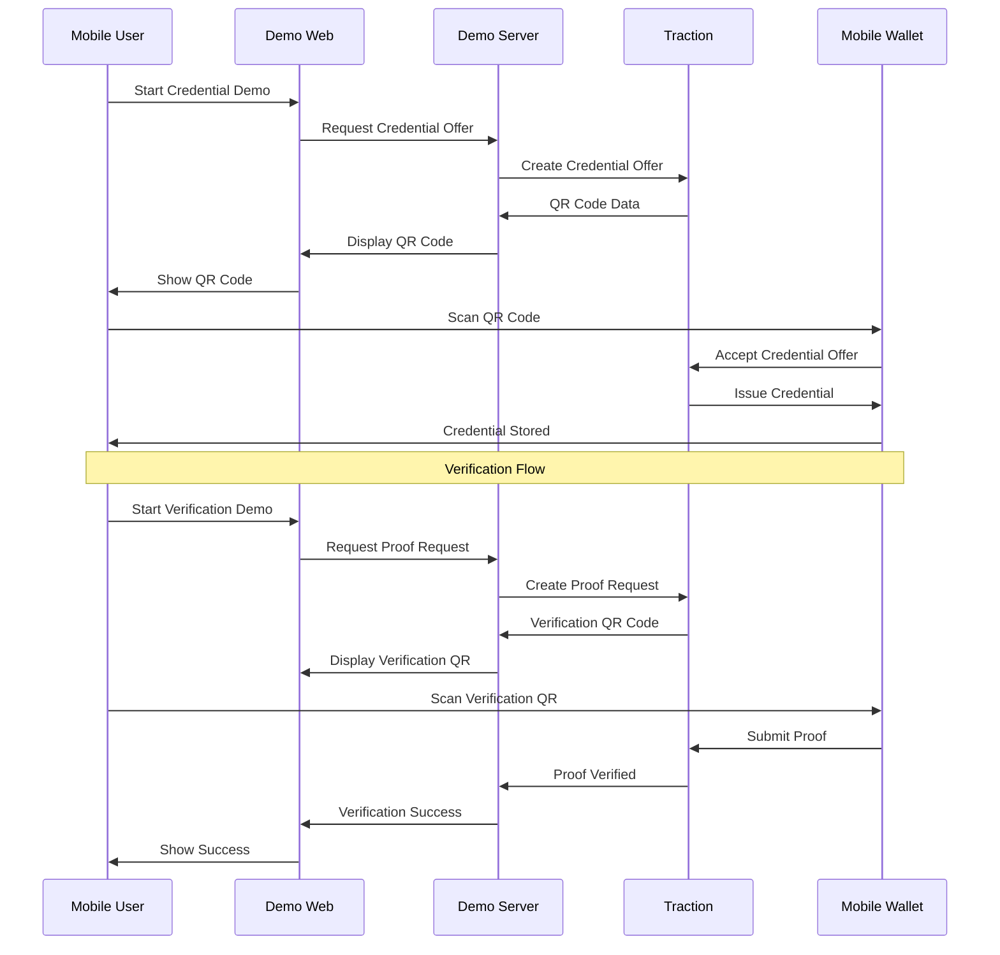
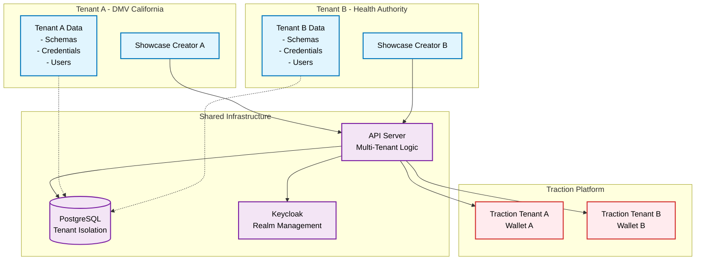
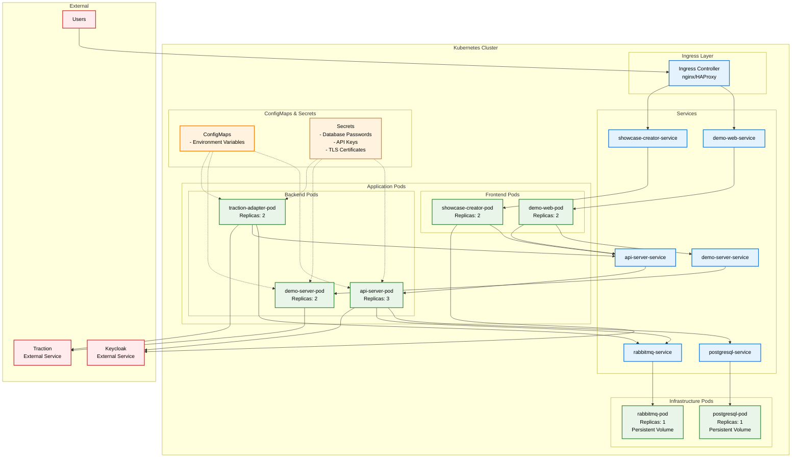

# BC Wallet Demo System Architecture

This document contains multiple focused diagrams showing different aspects of the BC Wallet Demo system architecture.

## System Components

### Frontend Applications (2 containers)

- **bc-wallet-demo-web** (Port 5002) - React-based demo wallet UI
- **bc-wallet-showcase-creator** (Port 5003) - Next.js admin interface

### Backend Services (3 containers)

- **bc-wallet-api-server** (Port 5005) - Core REST API
- **bc-wallet-demo-server** (Port 5004) - Demo-specific backend
- **bc-wallet-traction-adapter** (Port 3000) - Traction integration adapter

### Infrastructure Services (2 containers)

- **PostgreSQL** (Port 5432) - Primary database
- **RabbitMQ** (Port 5672) - Message broker

### External Services (2 services)

- **Keycloak** - OIDC authentication provider
- **Traction** - Hyperledger Indy/Aries credential platform

## 1. High-Level System Overview

This diagram shows the main components and their relationships at a high level.

## 2. Container Services & Infrastructure

This diagram focuses on the internal Docker containers and infrastructure components.

## 3. External Service Integrations

This diagram shows how the system connects to external services.

## 4. Data Flow & Message Processing

This diagram shows how data and messages flow through the system for credential operations.

## 5. Authentication & Authorization Flow

This diagram shows how authentication works across the different components.

## 6. Credential Issuance & Verification Flow

This diagram shows the end-to-end credential workflow from the demo perspective.

## 7. Multi-Tenant Architecture

This diagram shows how the system supports multiple organizations (tenants) with data isolation.

## 8. Deployment Architecture (Kubernetes/OpenShift)

This diagram shows how the system is deployed in a Kubernetes environment.

